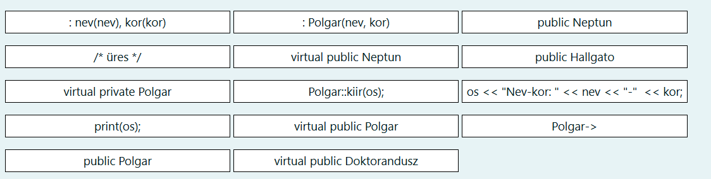
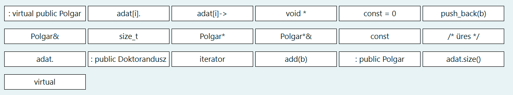
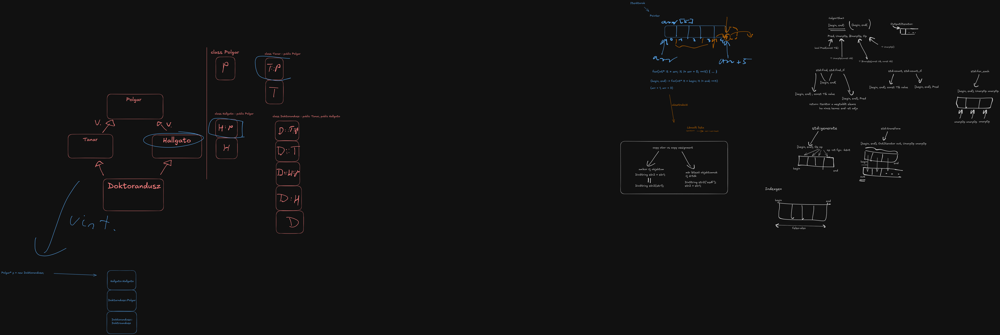

## Gyémánt öröklés feladat

Új neptun rendszer (Neptun) kerül fejlesztésre, heves viták után a vezetőség a C++ mellett tette le a voksát. Feladatunk most egy demo program készítése a rendszer modellezésére, amit később lehet hogy tovább bővítünk. Szeretnénk nyilvántartani minden egyetemi polgárt (`Polgar`), minden polgárnak van neve és életkora. Az egyetemen a polgárokhoz tartoznak a `Hallgató`k és a `Tanár`ok is. A hallgatók számon tartják az eddig teljesített kreditek összegét, míg a tanárok az eddig konzultált hallgatók számát. Speciális helyzetben vannak a Doktoranduszok, akik hallgatók és tanárok is egyben. Mindenkinek kiírható a neve és életkora, valamint a hallgatóknál a teljesített kredit, tanároknál a konzultált hallgatók száma. `Doktorandusz` viselkedhet tanárként és hallgatóként is. Minden egyednél kiírhatók (`kiir()`) ezek az értékek a kapott ostream paraméterre.  A Neptun rendszerbe új polgárt bevinni a `hozzaad()` metódussal lehet, illetve paraméterben megadott adatfolyamra ki lehet listázni az összes egyetemi polgár minden adatát (`listaz()`). Ha a `Neptun` rendszer megsemmisül, a benne tárolt adatok is elvesznek.

#### Gondoljuk végig!

Az modellünk a következő:

* Van egy `Polgar` ősosztály
* Belőle származik a `Tanar` és a `Hallgato`
* A `Doktorandusz` egyszerre `Tanar` és `Hallgato` is

***Ez gyémánt öröklés probléma!*** A `Doktorandusz` osztályban a `Polgar` memóriaképe kétszer, a `Tanar` és `Hallgato` osztályon keresztül is megjelenik.

A megoldás: virtuális ős kell a `Tanar` és `Hallgato` osztálynak!

### Tanár

```cpp
#ifndef TANAR_H_DEFINED
#define TANAR_H_DEFINED
#include "polgar.h"

class Tanar : [/*...*/] {
    int konzultalt; //eddig konzultált hallgatók száma
public:
    Tanar(string nev, int kor, int konzultalt) [/*...*/], konzultalt(konzultalt) {}
    void kiir(ostream& os) const {
        [/*...*/]  // kiírjuk a nevét és a korát
        os << ", konzultalt: " << konzultalt;
    }
};
#endif
```



??? note "Megoldás"

    ```cpp
    #ifndef TANAR_H_DEFINED
    #define TANAR_H_DEFINED
    #include "polgar.h"

    class Tanar : [virtual public Polgar] { //virtual base, mivel gyémánt probléma van.
        int konzultalt; //eddig konzultált hallgatók száma
    public:
        Tanar(string nev, int kor, int konzultalt) [: Polgar(nev, kor)], konzultalt(konzultalt) {}
        void kiir(ostream& os) const {
            [Polgar::kiir(os);]  // nem duplikálunk kódot, ősbe delegálás
            os << ", konzultalt: " << konzultalt;
        }
    };
    #endif
    ```

### Neptun

```cpp
#ifndef NEPTUN_H_DEFINED
#define NEPTUN_H_DEFINED
#include <vector>
#include "polgar.h"


class Neptun [/*...*/] {
 std::vector<[/*...*/]> adat;
public:
 void hozzaad([/*...*/] b) {
    adat.[/*...*/];
 }
 void listaz(ostream& os) [const] {
    for ([/*...*/] i = 0; i < [/*...*/]; ++i) {
       [/*...*/]kiir(os);
       os << std::endl;
    }
 }
 [/*...*/] ~Neptun();     // külön valósítjuk meg
};
#endif
```




??? note "Megoldás"

    ```cpp
    #ifndef NEPTUN_H_DEFINED
    #define NEPTUN_H_DEFINED
    #include <vector>
    #include "polgar.h"


    class Neptun [/* üres */] {
    std::vector<[Polgar*]> adat;
    public:
    void hozzaad([Polgar*] b) {
        adat.[push_back(b)];
    }
    void listaz(ostream& os) [const] {
        for ([size_t] i = 0; i < [adat.size()]; ++i) {
        [adat[i]‑>]kiir(os);
        os << std::endl;
        }
    }
    [/* üres */] ~Neptun();     // külön valósítjuk meg
    };
    #endif
    ```

## Adapter

### PyTomb std::vector adapter

Az adapter tervezési minta lényege a következő: 

Van egy osztály, ami elvár egy interfészt egy másik osztálytól (`Adaptee`), viszont az `Adaptee` osztály nem felel meg ennek az interfésznek. Ezért készítünk egy új osztályt (`Adapter`), aki megvalósítja az elvárt interfészt az `Adaptee` osztály felhasználásával.

A jelenlegi feladatban egy `PyTomb` nevű adaptert kell elkészíteni, ami az `std::vector<T>` osztály `operator[]` tagfüggvényét változtatja meg olyan módon, hogy negatív index esetén a tömböt hátulról indexel.
Elvárás továbbá az is, hogy a `PyTomb` és `std::vector` kompatiblisek legyenek.

???+ note "Gondolatmenet"

    A kompatibilitás miatt fontos, hogy az `std::vector<T>` -ből le kell származni. A C++ name lookup szabályai miatt ha egy template paramétertől függő ősosztályból szeretnénk tagfüggvényt hívni, akkor ki kell írni a teljes ősosztályt elé, pl `std::vector<T>::at(idx);`
    Erre azért van szükség, mivel a template olvasásakor a fordító a neveket nem keresi a template paraméterektől függő ősosztályokban (hiszen még nem tudja, hogy melyik template paraméterekkel van használva a sablon, és explicit specializációk miatt nem tudja, melyik specializációban keressen.)

    ```cpp
    template<typename T>
    struct Foo{
        void f() {}
    };

    template<>
    struct Foo<int>{
        void k() {}
    }

    template<typename T>
    struct Bar : Foo<T>{
        void b() { f(); } 
        /*hiba, nincs találat f-re, mivel Foo<T> ősosztály függ T-től,
        és nem biztos, hogy minden Foo<T> -ben létezik f(), pl itt Foo<int> -ben nem.
        */
    };
    ```

??? note "Megoldás"

    ```cpp

    template<typename T>
    class PyTomb : public std::vector<T> /*dependent base class! figyelni kell a nevekre*/{
        public:

        using std::vector<T>::vector; // minden vector nevű fgv. átvétele az std::vector<T> -ből, "ctor öröklés"

        T& operator[](long long idx){
            if(idx >= 0){
                return std::vector<T>::at(idx); // at tagfgv. csinál bounds checkinget is, ezt nekünk nem kell megcsinálni
            }else{
                return std::vector<T>::at(std::vector<T>::size() - idx);
            }
        }

        const T& operator[](long long idx) const{ //ugyanez const-ra is!
            if(idx >= 0){
                return std::vector<T>::at(idx); // at tagfgv. csinál bounds checkinget is, ezt nekünk nem kell megcsinálni
            }else{
                return std::vector<T>::at(std::vector<T>::size() - idx);
            }
        }
    }
    ```

## Iterátorok

### Dinamikus tömb iterátor

Egészítse ki a lenti dinamikus generikus tömböt iterátorral! Az iterátort a generikus osztály belső publikus osztályaként implementálja! A megadott kódrészletekhez ne nyúljon, csak kiegészítheti azt!

Az iterátornak a következő funkciókkal kell rendelkeznie:

* paraméter nélküli konstruktor: nullptr állít be (az iterátor érvénytelen)
* egyparaméteres konstruktor: konstans GenDinTomb referenciát vesz át, a tömb elejére állítja az iterátort
* kétparaméteres ctor: konstans GenDinTomb referenciát és egy size_t indexet vesz át, az iterátort a tömb indexedik elemére állítja
* dereferáló (*) operátor: referenciát ad vissza, ha az iterátor érvénytelen (nullptr, túlcímzés), dobjon const char* típusú kivételt!
* Összehasonlító operátorok (== és !=), összehasonlít két iterátort, logikai értékkel tér vissza, elvárt módon működjön.
* Preinkremens operátor: Ha az iterátor nem érvénytelen, akkor a következő elemre mutat a tömbben, különben nem csinál semmit.

```cpp
#include <iostream>

template <typename T>
class GenDinTomb {
    T* elements; // pointer a din. foglalt adatra
    size_t n;    // méret
public:
    GenDinTomb(size_t n, const T& a = T());
    GenDinTomb(const GenDinTomb&);
    GenDinTomb& operator=(const GenDinTomb&);
    size_t size() const { return n; }
    void insert(const T& e);
    //segédfgv. kiírja a tömb méretét és elemeit 
    void printDbg() const; 
    //--------------------------csak ezt szerkesztheti-------------------------
    class iterator {
        //ezt kell megírni
    };
    //------------------------------eddig-------------------------------
};
```

??? note "Megoldás"

    Az iterátor a pointerek absztrakciója. Az interfészük hasonló a pointerekhez, viszont extra funkcionalitást valósítanak meg.
    A feladatban *bounds checking*-et kell implementálni, azaz figyelni kell, hogy valóban a tömb egy elemét érjük el az iterátoron keresztül.
    Ehhez biztosan kelleni fog 2 tagváltozó: A jelenlegi elemet azonosító (pointer v. index), valamint a tömb végét azonosító (pointer v. index).
    Ebben a megoldásban a dinamikus tömbre mutató pointer + index a tömbbe megoldást választottam, de nem ez az egyetlen jó megoldás.

    ```cpp

    class iterator {
        GenDinTomb<T>* tomb; //erre a tömbre vonatkozik az index
        size_t current_idx; //az elem indexe amire az iterátor mutat
    public:
        iterator() : tomb(nullptr), current_idx(0) {}
        iterator(GenDinTomb& tomb) : tomb(&tomb) {}
        iterator(GenDinTomb& tomb, size_t idx) : tomb(&tomb), current_idx(idx) {}

        T& operator*() {
            if(tomb == nullptr || current_idx >= tomb.size()){ // ha invalid a tömb vagy invalid az index akkor hibát kell dobni
                throw "Helytelen indirekcio";
            }
            return tomb[current_idx];
        }

        bool operator==(const iterator& rhs) const {
            return tomb == rhs.tomb && current_idx == rhs.idx;
        }

        bool operator!=(const iterator& rhs) const {
            return !(*this == rhs);
        }

        iterator& operator++(){
            if(tomb != nullptr && current_idx < tomb.size()){ // ha valid a tömb és valid az iterátor akkor léptetjük egyet (valid iterátor: tömbbe vagy egyel a tömb után mutat)
                current_idx++;
            }

            return *this;
        }
    };
    ```

## STL eszközök

### Indexgen

Készítsen egy olyan függvényt (indexgen néven), ami két paramétert kap: Egy kezdő számértéket (int), valamint egy felső határt (int). A függvény feladata egy olyan tömb (std::vector<int>) visszaadása, ami az összes egész számot tartalmazza a kezdő számtól(alsó határ) a felső határig (azt már nem).  A függvény fejlécét megadtuk, azt ne változtassa!

Használja fel ehhez az `std::generate` függvényt! For vagy while ciklust ne használjon! A megoldáshoz további segédfüggvényt, osztályt is felvehet!

Példa a használatra:

```cpp
std::vector<int> t = indexgen(0, 4);
for (int k : t)
    std::cout << k << ','; //0,1,2,3,
```

B. feladatrész: Alakítsa át úgy a függvényt, hogy tetszőleges típusokra működjön, a posztinkremens és a kivonás művelet értelmezve van a típuson! (persze ekkor a függvényfejléchez hozzányúlhat)

???+ note "Gondolatmenet"

    Az `std::generate` függvény két iterátort, valamint egy hívható objektumot vesz át (generátor). A két iterátor közt megy végig, és meghívja a generátort, és az iterátoron keresztül beállítja az adott elemet a generátor visszatérési értékére.

    ```cpp
    // ez történik a generate belsejében
    for(auto it = begin; it != end; ++it){
        *it = generator();
    }
    ```

??? note "Megoldás"

    A. feladatrész: int típusra

    ```cpp
    struct CounterFunctor{
        CounterFunctor(int x) : x(x) {}
        int operator()() {
            return x++;
        }

        private:
        int x;
    };

    std::vector<int> indexgen(int also, int felso){
        std::vector<int> result(felso-also); //ebben lesz az eredmény, a ctor-ban a méretet adjuk meg, hogy a begin és end jók legyenek.
        CounterFunctor gen(also); // készítünk egy számláló generátort ami az alsó értékrők indul
        std::generate(result.begin(), result.end(), gen); // átadjuk az eredmény range-t és a generátor példányt. NEM gen(), hanem gen !!
        return result;
    }
    ```

    B. feladatrész: int helyett minden típusra

    ```cpp
    template<typename T>
    struct CounterFunctor{
        CounterFunctor(const T& x) : x(x) {}
        T operator()() {
            return x++;
        }

        private:
        T x;
    };

    template<typename T>
    std::vector<T> indexgen(const T& also, const T& felso){
        std::vector<T> result(felso-also); //ebben lesz az eredmény, a ctor-ban a méretet adjuk meg, hogy a begin és end jók legyenek.
        CounterFunctor<T> gen(also); // készítünk egy számláló generátort ami az alsó értékrők indul. Nem kell a <T>, de kiírhatjuk
        std::generate(result.begin(), result.end(), gen); // átadjuk az eredmény range-t és a generátor példányt. NEM gen(), hanem gen !!
        return result;
    }
    ```

### Boolindexing

Készítsen egy olyan függvényt boolindexing néven, ami két paramétert kap: egy `vector<int>` tömböt, valamint egy predikátumot. A függvény feladata egy olyan logikai tömb (`std::vector<bool>`) visszaadása, amiben az 'idx' indexű helyen akkor áll igaz, ha az eredeti tömbben az idx helyen lévő értékre a predikátum igaz, különben hamis. Implementálja a megoldáshoz a "paros" predikátumot, ami akkor ad vissza igazat, ha a paraméterül kapott egész szám páros.

Használja fel ehhez az `std::transform` függvényt! For vagy while ciklust ne használjon! A megoldáshoz további segédfüggvényt, osztályt is felvehet!

Példa a használatra:

```cpp
std::vector<int> t = { 1, 2, 3, 4 };
std::vector<bool> tb = boolindexing(t, paros);
for (bool k : tb)
    std::cout << k << ','; //0,1,0,1,
```

B. feladatrész: int helyett minden típusra

???+ note "Gondolatmenet"

    Az `std::transform` függvény átvesz három iterátort valamint egy hívható objektumot (művelet). A három iterátor a következőt jelenti:
    * bemeneti range eleje
    * bemeneti range vége
    * kimeneti range eleje

    A művelet pedig a bemeneti range elemtípusát (Az A. feladatban `int`) veszi át, és a kimeneti range elemtípusát adja vissza (ebben a feladatban `bool`).

    Azaz a transform egy másik, "kimeneti" iterátorral határozza meg, hogy hova kezdi el írni az eredményeket.

    Az eredményeket úgy kapja meg, hogy a műveletet meghívja a bemeneti range összes elemére egyesével és a visszaadott értéket kiírja a kimeneti range-be.

    Belül valami ilyesmi történik:

    ```cpp
    for(auto it = begin, it != end; ++it){
        *out = muvelet(*it);
        ++out;
    }
    ```

??? note "Megoldás"

    A. feladatrész

    ```cpp
    template<typename Op>
    std::vector<bool> boolindexing(const std::vector<int>& v, Op muvelet){
        std::vector<bool> result(v.size());
        std::transform(v.begin(), v.end(), result.begin(), muvelet); // input begin, input end, output being, binary op

        return result;
    }
    ```

    A példa `paros` művelet pedig egy egyszerű függvény lesz:

    ```cpp
    bool paros(int x){
        return x % 2 == 0;
    }
    ```

    B. feladatrész:

    Csak az int-et kell T -re cserélni:

    ```cpp
    template<typename T, typename Op>
    std::vector<bool> boolindexing(const std::vector<T>& v, Op muvelet){
        std::vector<bool> result(v.size());
        std::transform(v.begin(), v.end(), result.begin(), muvelet); // input begin, input end, output being, op

        return result;
    }
    ```

## Egyéb CodeRunner feladatok

### MySet

Implementáljon egy generikus tárolót, ami halmazként fog működni. Az osztályt MySet néven implementálja. A halmazban tárolt elemek típusát és annak méretét (size_t) sablonparaméterként lehet beállítani. Alapértelmezetten a halmaz mérete 10. Az elemeket egy fix méretű tömbben a sablonozás segítségével kell eltárolni, ezt a tömböt elements-nek nevezze el. Feltételezheti, hogy a megadott típusoknak van alapértelmezett konstruktora, továbbá érvényes rajtuk az összehasonlító (==) operátor.  Figyeljen a láthatóságra. Továbbá:

* contains metódus: igaz logikai értéket ad vissza, ha a paraméterül kapott elem benne van a halmazban már, különben hamis értéket. 
* insert metódus: belerakja a halmazba, a kapott értéket (ha nem volt benne). 
  Ha nem volt benne, viszont a halmaz kapacitása (sablonparaméter) már nem elég, akkor const char* kivételt dob. Ha a paraméterül kapott érték már szerepel a halmazban, nem csinál semmit. 
* size metódus: visszaadja az eddig tárolt elemek számát.
* capacity metódus: visszaadja a halmaz kapacitását (mennyi különböző elemet lehet maximum belerakni)

???+ note "Gondolatmenet"

    A feladat lényege a nem-típus sablonparaméter használata. Mivel a sablonparaméter fordítási időben konstans, ezért lehet tömb méretéhez használni. A feladathoz éppen ezért nincs szükség dinamikus memóriakezelésre.

??? note "Megoldás"

    ```cpp
    template<typename T, size_t C = 10> // milyen típust és max mennyit tárol
    class MySet{
        T elements[C]; // C fordítási időben konstans tehát használható tömb méretként
        size_t meret; // tényleges méret, amennyit beleraktunk már
    public:
        MySet() : meret(0) {} // meret 0-ról induljon

        bool contains(const T& t) const {
            for(size_t i = 0; i < meret; ++i){
                if(elements[i] == t){
                    return true;
                }
            }
            return false;
        }

        void insert(const T& t){
            if(!contains(t)){ // contains felhasználása!
                if(meret >= C){
                    throw "Tele van";
                }

                elements[meret] = t;
                ++meret;
            }
        }

        size_t size() const {
            return meret;
        }

        size_t capacity() const {
            return C;
        }
    };
    ```

### Serializable Complex

Készítsen szerializálható osztályt a Complex és a Serializable osztály felhasználásával: A SComplex legyen kompatibilis mindkét osztállyal! A fenti osztályok deklarációja a következő: 

```cpp
class Complex {
protected:
    float r, i; // r+ij
public:
    Complex(float r, float i);
    float getR() const;
    float getI() const;
};

struct Serializable {
    virtual void write(std::ostream& os) const = 0;
    virtual void read(std::istream& is) = 0;
};
```

Az SComplex osztály write függvénye a stream-re a következő formátumban írja ki az objektum adattagjait: `"SComplex [r]+[i]j\n"` (a [x] helyére az adott adattag kerül, például `"SComplex 2+3j"`). A read függvény pedig ilyen formában olvassa be a kiszerializált adatokat.  Ha a read függvény rossz formátumot kap (például rossz név vagy nem +/j szerepel), akkor kivételt dob a következő karakterlánccal: `"error"`.

??? note "Megoldás"

    A szerializéció lényege, hogy a kiírással azonos formátumban olvassuk vissza az elemeket (ezt a feladat is elvárja). Mint a Seralizable, mind a Complex osztályból származtatunk, viszont a Complex osztályt csak felhasználjuk, nem kell belőle semmit sem újraimplementálni!

    ```cpp
    class SComplex: public Serializable, public Complex {
    public:
        SComplex(float r, float i): Complex(r, i) {} // Complex ctor-t csak meg kell hívni, nem kellenek újra az adattagok.
        void write(std::ostream& os) const override {
            os << "SComplex " << r << "+" << i << "j" << std::endl;
        }
        void read(std::istream& is) override {
            std::string type_name;
            char op;
            char j;
            is >> type_name >> r >> op >> i >> j;
            if (op != '+' || j != "j" || type_name != "SComplex") {
                throw "error";
            }
        }
    };
    ```

## A konzultáción készült whiteboard


